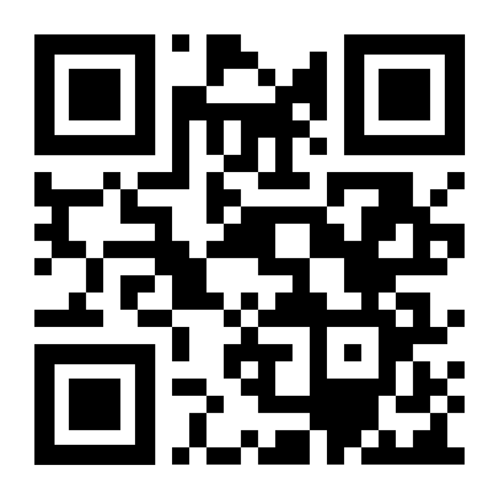

# LBS Kreativa Gymnasiet – Förbättrad React-implementation

Vite + React-implementation baserad på den medföljande grafiska manualen för LBS.

## Kör projektet

```bash
npm install

npm run dev
```

## Innehåller

* `src/app.jsx` – huvudkompositionen för sidan
* Big Shoulders Text, Onest och IBM Plex Mono
* LBS färgsystem och monokromatiskt färgpar
* Pixelblock-inspirerade layouter
* Textblock och detaljer inspirerade av tangentbordssymboler
* Animerad Open House-karusell
* Återanvändbar `ImagePlaceholder`-komponent
* Grundstruktur för ett separat kreativt bildgalleri
* Avancerade hover-effekter och mikrointeraktioner
* Responsiv navigering och layout
* Typografi och radavstånd anpassade för svenska tecken

## QR-kod för tillgång till websidan


## Lägg till riktiga bilder

Lägg bilderna i `public/images/` och använd:

```jsx
<ImagePlaceholder
  src="/images/elevprojekt.jpg"
  alt="Elever som arbetar med ett projekt"
/>
```

### Designanteckningar

Sidans övergångar skapar medvetet större mellanrum mellan de olika huvudsektionerna. Samtidigt används kontinuerligt rörlig LBS-inspirerad typografi och subtila flytande pixeldetaljer.

Stora svenska rubriker använder extra radavstånd samt utrymme ovanför och under texten för att Å, Ä och Ö inte ska kännas trånga eller riskera att klippas av.
